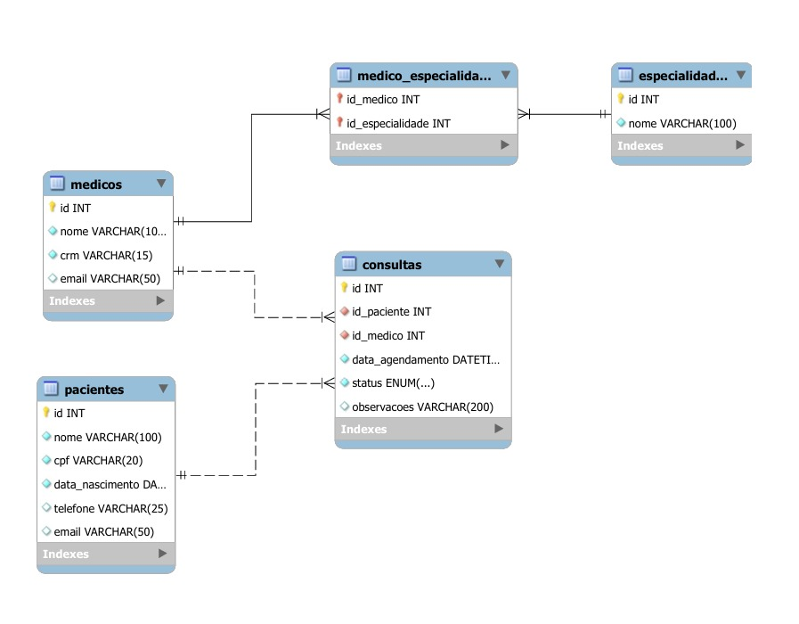

# Sistema de Gerenciamento Clínico

-----

## Descrição Detalhada do Domínio do Problema

O Sistema de Gerenciamento Clínico foi desenvolvido com o objetivo de otimizar o controle de informações em clínicas médicas. A aplicação centraliza dados relacionados a médicos, pacientes, consultas e especialidades, permitindo que o gerenciamento dessas informações seja feito de maneira simples, segura e integrada.

O sistema visa eliminar o uso de planilhas ou registros manuais, oferecendo uma interface padronizada e conectada a um banco de dados relacional. Dessa forma, busca-se aumentar a eficiência no agendamento de consultas, reduzir erros administrativos e aprimorar a organização geral do ambiente clínico.

-----

## Modelo Conceitual e Lógico do Banco de Dados

O modelo do banco de dados foi estruturado no MySQL, utilizando o paradigma relacional.

As principais entidades do sistema são:

  * **Paciente:** Armazena informações pessoais e de contato dos pacientes.
  * **Médico:** Contém os dados cadastrais dos profissionais da clínica.
  * **Especialidade:** Define as áreas de atuação médica (ex: Cardiologia, Pediatria etc.).
  * **Consulta:** Registra o agendamento de consultas, associando pacientes e médicos.
  * **Médico\_Especialidade:** Tabela de relacionamento N:N entre médicos e especialidades.

### Modelo Lógico do Banco de Dados:


-----

## Scripts SQL (Resumo da Estrutura do Banco de Dados)

O banco de dados do sistema foi modelado e implementado no MySQL, com o nome `Modelo_Logico`. Ele é composto por cinco tabelas principais: `Pacientes`, `Medicos`, `Especialidades`, `Consultas` e `Medico_Especialidade` (tabela de relacionamento N:N).

Abaixo está um resumo do script de criação das entidades principais. O código completo pode ser encontrado no arquivo `src/database/schema.sql`.

```sql
CREATE TABLE Pacientes (
  idPaciente INT AUTO_INCREMENT PRIMARY KEY,
  nomePaciente VARCHAR(100) NOT NULL,
  cpfPaciente VARCHAR(20) NOT NULL UNIQUE,
  data_nascimentoPaciente DATE NOT NULL,
  telefonePaciente VARCHAR(25),
  emailPaciente VARCHAR(50) UNIQUE
);

CREATE TABLE Medicos (
  idMedico INT AUTO_INCREMENT PRIMARY KEY,
  nomeMedico VARCHAR(100) NOT NULL,
  crmMedico VARCHAR(15) NOT NULL UNIQUE,
  emailMedico VARCHAR(50) UNIQUE
);

CREATE TABLE Especialidades (
  idEspecialidade INT AUTO_INCREMENT PRIMARY KEY,
  nomeEspecialidade VARCHAR(100) NOT NULL UNIQUE
);

CREATE TABLE Medico_Especialidade (
  id_medico INT,
  id_especialidade INT,
  PRIMARY KEY (id_medico, id_especialidade),
  FOREIGN KEY (id_medico) REFERENCES Medicos (idMedico) ON DELETE CASCADE,
  FOREIGN KEY (id_especialidade) REFERENCES Especialidades (idEspecialidade) ON DELETE CASCADE
);

CREATE TABLE Consultas (
  idConsulta INT AUTO_INCREMENT PRIMARY KEY,
  idPaciente INT NOT NULL,
  idMedico INT NOT NULL,
  data_agendamentoConsulta DATETIME NOT NULL,
  statusConsulta ENUM('Agendada', 'Cancelada', 'Realizada') DEFAULT 'Agendada',
  observacoesConsulta VARCHAR(200),
  FOREIGN KEY (idPaciente) REFERENCES Pacientes (idPaciente),
  FOREIGN KEY (idMedico) REFERENCES Medicos (idMedico)
);
```

-----

## Arquitetura do Código e Responsabilidades dos Módulos

O projeto foi desenvolvido em Node.js utilizando o framework Express, adotando uma arquitetura modular, onde cada módulo possui uma responsabilidade específica:

  * **server.js:** Ponto de entrada que importa o app e inicia o servidor.
  * **app.js:** Define e configura a instância da aplicação.
  * **routes/:** Contém as rotas de cada entidade (Paciente, Médico, Consulta, etc.).
  * **controllers/:** Realiza o controle das implementações.
  * **models/:** Define a estrutura das tabelas e interações com o banco de dados MySQL.
  * **services/:** Conjunto que engobla as regras da aplicação.
  * **config/:** Responsavel pelo conexão com banco de dados.
  * **database/:** Armazenamento dos Scripts padrão.

Essa separação de responsabilidades visa garantir maior organização, escalabilidade e facilidade de manutenção do código.

-----

## Exemplos de Comandos SQL Implementados

A seguir estão alguns exemplos de comandos SQL desenvolvidas e testados no projeto, refletindo o funcionamento real do banco de dados.

**Exemplo de SELECT:**
**Listar todas as consultas com o nome do paciente, médico e especialidade**

```sql
SELECT
  c.idConsulta,
  p.nomePaciente AS Paciente,
  m.nomeMedico AS Medico,
  e.nomeEspecialidade AS Especialidade,
  c.data_agendamentoConsulta AS Data,
  c.statusConsulta AS Status
FROM Consultas c
JOIN Pacientes p ON c.idPaciente = p.idPaciente
JOIN Medicos m ON c.idMedico = m.idMedico
JOIN Medico_Especialidade me ON me.id_medico = m.idMedico
JOIN Especialidades e ON me.id_especialidade = e.idEspecialidade;
```
Exemplo de INSERT INTO:
**Insere uma consulta no Banco**

```sql
INSERT INTO Consultas (id_paciente, id_medico, data_agendamento) 
    VALUES (?, ?, ?)
```

Exemplo de UPDATE:
**Atualiza um registro no Banco**
```sql
UPDATE Consultas SET ${campos} WHERE id = ?
```

Exemplo de DELETE:
** Exclui um registro do Banco**

```sql
DELETE FROM Consultas WHERE id = ?
````


-----

## Instruções de Execução do Projeto

### 1\. Dependências

Certifique-se de ter instalado:

  * Node.js (versão 18 ou superior)
  * MySQL Server
  * `npm` ou `yarn` para gerenciamento de pacotes

### 2\. Clonando o Repositório

```bash
git clone https://github.com/filipi2601/consulta-medica.git
cd consulta-medica
```

### 3\. Instalando as Dependências

```bash
npm install
```

### 4\. Configuração do Banco de Dados

Crie um banco no MySQL com o nome `Modelo_Logico` (ou o nome que preferir).

```sql
CREATE DATABASE IF NOT EXISTS Modelo_Logico;
```

### Abrir o Workbench.

   * Ir em File > Open SQL Script.
   * Selecionar o arquivo src/database/schema.sql.
   * Clicar no botão ⚡ (Executar) para rodar o script.

No arquivo `.env`, configure:

```ini
DB_HOST=localhost
DB_USER=root
DB_PASS=sua_senha
DB_NAME=Modelo_Logico
```

### 5\. Executando o Servidor

```bash
npm start
```

O servidor será iniciado em: `http://localhost:3000`

### 6\. Executando Testes Unitários

```bash
npm test
```

Os testes utilizam o framework Jest e podem ser encontrados na pasta `/tests`.

-----

## Endpoints da API

A API foi desenvolvida em Node.js (Express) e segue o padrão RESTful, estruturando os módulos de forma independente para cada entidade: Pacientes, Médicos, Consultas e Médico-Especialidade. Os testes podem ser realizados por meio das coleções Postman disponíveis na pasta `/assets`.

### Pacientes API (CRUD)

**Base URL:**
`http://localhost:3000/api/pacientes`

#### ➤ Criar Paciente

`POST /api/pacientes`

Cria um novo paciente no sistema.

**Exemplo de Requisição:**

```json
{
  "nome": "Fernanda Lima",
  "cpf": "66666666666",
  "data_nascimento": "1992-09-10",
  "telefone": "(11) 96666-6666",
  "email": "fernanda.lima@email.com"
}
```

**Erros Comuns (400):**

> "Todos os campos obrigatorios devem ser informados."
> "CPF invalido. Informe 11 digitos."
> "Data de nascimento nao pode ser futura."
> "Ja existe paciente com este CPF."
> "Ja existe paciente com este email."

#### ➤ Listar Todos os Pacientes

`GET /api/pacientes`

Retorna todos os pacientes cadastrados.

**Resposta Esperada (200 OK):**

```json
[
  {
    "id": 1,
    "nome": "Ana Silva",
    "cpf": "11111111111",
    "email": "ana.silva@email.com"
  }
]
```

#### ➤ Buscar Paciente por ID

`GET /api/pacientes/{id}`

Retorna os detalhes de um paciente específico.

  * **Erro 404 Not Found:** Paciente não encontrado.

#### ➤ Atualizar Paciente

`PUT /api/pacientes/{id}`

Atualiza os dados de um paciente existente.

**Exemplo de Requisição:**

```json
{
  "nome": "Ana Silva Atualizada",
  "cpf": "11111111111",
  "data_nascimento": "1990-05-15",
  "telefone": "(11) 90000-0001",
  "email": "ana.silva@atualizado.com"
}
```

**Erros:**

  * **400:** "Ja existe paciente com este email."
  * **404:** "Paciente nao encontrado."

#### ➤ Remover Paciente

`DELETE /api/pacientes/{id}`

Remove um paciente do sistema.

  * **204 No Content:** Exclusão bem-sucedida.
  * **404 Not Found:** Paciente não encontrado.
  * **400/500:** Paciente possui consultas vinculadas.

-----

### Médicos API (CRUD)

**Base URL:**
`http://localhost:3000/api/medicos`

#### ➤ Criar Médico

`POST /api/medicos`

Cria um novo médico no sistema.

**Exemplo de Requisição:**

```json
{
  "nome": "Dr. João Pereira",
  "crm": "98765-SP",
  "email": "joao.pereira@clinica.com"
}
```

**Erros Comuns:**

> "Todos os campos obrigatorios devem ser informados."
> "CRM já cadastrado."
> "Email já cadastrado."

#### ➤ Listar Todos os Médicos

`GET /api/medicos`

Retorna todos os médicos cadastrados.

**Resposta Esperada (200 OK):**

```json
[
  {
    "id": 1,
    "nome": "Dr. Carlos Oliveira",
    "crm": "12345-SP",
    "email": "carlos.oliveira@clinica.com"
  }
]
```

#### ➤ Buscar Médico por ID

`GET /api/medicos/{id}`

Retorna os dados de um médico específico.

  * **404 Not Found:** Médico não encontrado.

#### ➤ Atualizar Médico

`PUT /api/medicos/{id}`

Atualiza os dados de um médico existente.

**Exemplo de Requisição:**

```json
{
  "nome": "Dr. Carlos Oliveira Atualizado",
  "crm": "12345-SP",
  "email": "carlos.oliveira@atualizado.com"
}
```

**Erros:**

  * **400:** "CRM já cadastrado."
  * **404:** "Médico não encontrado."

#### ➤ Remover Médico

`DELETE /api/medicos/{id}`

Remove um médico do sistema.

  * **204 No Content:** Médico removido.
  * **404 Not Found:** Médico não encontrado.

-----

### Consultas API (CRUD)

**Base URL:**
`http://localhost:3000/api/consultas`

#### ➤ Agendar Consulta

`POST /api/consultas`

Cria um novo agendamento de consulta.

**Exemplo de Requisição:**

```json
{
  "id_paciente": 1,
  "id_medico": 2,
  "data_agendamento": "2025-12-10T10:00:00"
}
```

**Resposta (201 Created):**

```json
{
  "idConsulta": 10,
  "nomePaciente": "João Silva",
  "nomeMedico": "Dra. Maria Oliveira",
  "data_agendamento": "2025-12-10T10:00:00",
  "status": "Agendada"
}
```

#### ➤ Listar Todas as Consultas

`GET /api/consultas`

Retorna todas as consultas cadastradas.

#### ➤ Buscar Consulta por ID

`GET /api/consultas/{id}`

Retorna os detalhes de uma consulta específica.

#### ➤ Atualizar Consulta

`PUT /api/consultas/{id}`

Atualiza os dados de uma consulta existente.

**Exemplo de Requisição:**

```json
{
  "status": "Realizada",
  "observacoes": "Paciente compareceu. Atualizado via Postman."
}
```

#### ➤ Cancelar Consulta

`DELETE /api/consultas/{id}`

Cancela uma consulta.

  * **204 No Content:** Cancelada com sucesso.
  * **404 Not Found:** Consulta não encontrada.

-----

### Médico-Especialidade API

**Base URL:**
`http://localhost:3000/api/medico-especialidade`

#### ➤ Vincular Médico a Especialidade

`POST /api/medico-especialidade`

Cria um vínculo entre um médico e uma especialidade.

**Exemplo de Requisição:**

```json
{
  "id_medico": 1,
  "id_especialidade": 2
}
```

**Erros:**

  * **400:** Campos faltando.
  * **409:** Vínculo já existente.

#### ➤ Listar Todos os Vínculos

`GET /api/medico-especialidade`

Retorna todas as associações médico ↔ especialidade.

#### ➤ Listar Especialidades de um Médico

`GET /api/medico-especialidade/{medicoId}`

Retorna todas as especialidades de um médico específico.

#### ➤ Atualizar Vínculo

`PUT /api/medico-especialidade/{medicoId}/{especialidadeId}`

Atualiza a especialidade vinculada a um médico.

**Exemplo de Requisição:**

```json
{
  "novo_id_especialidade": 2
}
```

**Respostas:**

  * **200 OK:** "Vínculo atualizado com sucesso\!"
  * **404 Not Found:** Vínculo inexistente.

#### ➤ Remover Vínculo

`DELETE /api/medico-especialidade/{medicoId}/{especialidadeId}`

Remove um vínculo específico entre um médico e uma especialidade.

  * **204 No Content:** Vínculo removido.
  * **404 Not Found:** Vínculo inexistente.

-----

## Variáveis de Ambiente (Postman)

| Variável | Descrição | Exemplo |
| :--- | :--- | :--- |
| `{{baseUrl}}` | URL base da API | `http://localhost:3000` |
| `{{pacienteId}}` | ID do paciente utilizado nos testes | `1` |
| `{{consultaId}}` | ID da consulta | `1` |
| `{{medicoId}}` | ID do médico | `1` |
| `{{especialidadeId}}` | ID da especialidade | `1` |

### Importando as Coleções

Para testar os endpoints localmente:

1.  Abra o Postman.
2.  Clique em **Import** \> **File**.
3.  Selecione a coleção desejada (ex: `Pacientes API (CRUD).json`).
4.  Configure a variável `baseUrl` com o endereço do servidor, normalmente: `http://localhost:3000`.
5.  Execute as requisições conforme os exemplos.

### Arquivos do Projeto

- [Collection_Consultas](assets/Consultas.json)
- [Collection_Especialidades](assets/Especialidades.json)
- [Collection_Medicos](assets/Medicos.json)
- [Collection_Pacientes](assets/Pacientes.json)
-----

## Equipe de Desenvolvimento

  * Lucas Barroso Silvestrini
  * Matheus Farias Garcia
  * Davi Greco
  * Felipe Amorim
  * Felipe Alexandre Pereira
  * Victor Augusto Farias Ferreira
